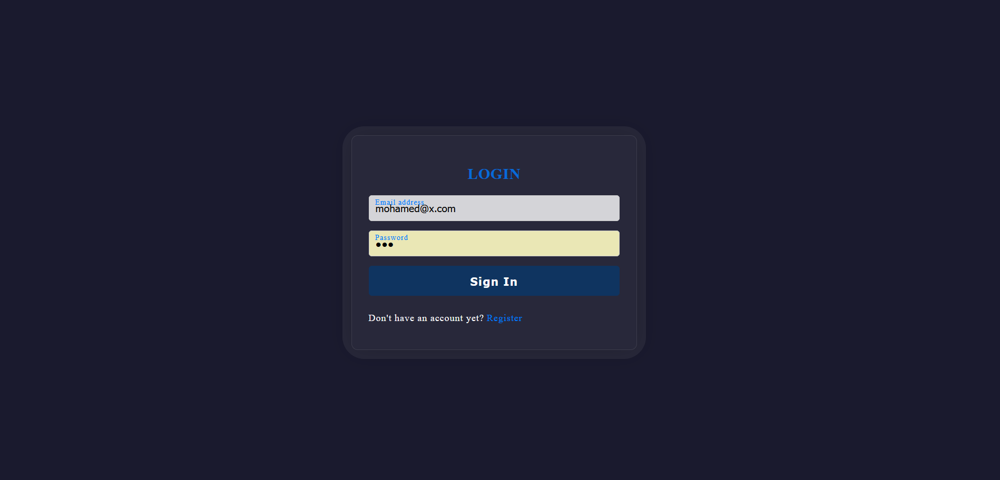

# Login and Sign-Up Pages

This repository contains code for a simple authentication system implemented using Node.js, Express, and Passport. It provides a login and sign-up functionality for users to access certain protected routes on the website.

## Prerequisites

- Node.js installed on your system.
- npm (Node Package Manager) installed on your system.

## How to Use

1. Clone the repository to your local machine using the following command:

```
git clone https://github.com/your-username/your-repo.git
```
2- Navigate to the cloned directory:

```
cd your-repo
```
3- Install the required dependencies:
```
npm install
```
4- Create a .env file in the root of the project and add the required environment variables:
```
NODE_ENV=development
SESSION_SECRET=your_session_secret
```
5- Start the server:

```
npm start
```
6- Open your web browser and go to ``` http://localhost:3000 ``` to access the login page.

# Features

## Login Page (login.ejs)

The login page allows users to log in using their email and password credentials. It contains the following elements:

- Email input: Users can enter their email address.
- Password input: Users can enter their password.
- Sign In button: Users can click this button to log in.
- Registration link: A link to the registration page for users who don't have an account yet.
   <br>



## Sign-Up Page (register.ejs)

The sign-up page allows new users to create an account on the website. It contains the following elements:

- Name input: Users can enter their name.
- Email input: Users can enter their email address.
- Password input: Users can enter their desired password.
- Sign Up button: Users can click this button to create an account.
- Login link: A link to the login page for users who already have an account.
 <br>
 


## Home Page (index.ejs)

The home pagea page similar to BitNine's official website
<br>


## Middleware

The application includes middleware functions to handle authentication and authorization:

- `checkAuthenticated`: This function checks if a user is authenticated before allowing access to certain routes. If the user is authenticated, they can proceed; otherwise, they will be redirected to the login page.
- `checkNotAuthenticated`: This function checks if a user is not authenticated before allowing access to certain routes. If the user is not authenticated, they can proceed; otherwise, they will be redirected to the home page.
 
### Technologies Used

    Node.js
    Express.js
    bcrypt (for password hashing)
    Passport.js (for authentication)
    EJS (Embedded JavaScript templates) for rendering HTML templates
